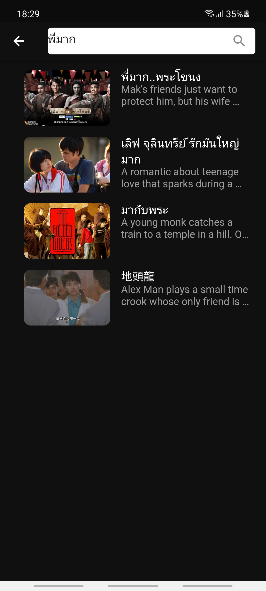

# Flutter MovieDB API

### API

- Go to [The Movie DB](https://www.themoviedb.org/) for create your API key.
- Replace MOVIE_API_KEY in constants.dart with your API key.

### Page

<!-- :white_check_mark: : Finish 
:parking: : Inprogress 
:soon: : Plan 
:x: : Abandon  -->

- :white_check_mark: MainPage
- :white_check_mark: SearchPage
- :white_check_mark: DetailPage

### Screenshort
 

- MainPage  

  

- SearchPage  

- DetailPage  

